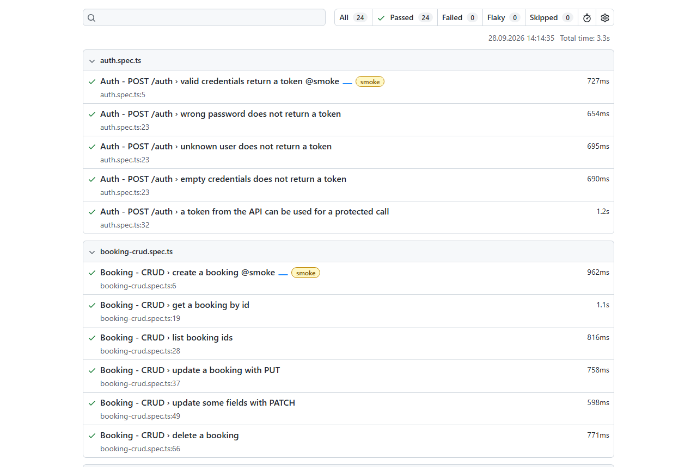

# API Test Automation – Restful-Booker

[](https://github.com/db-akyol/api-test-automation/actions/workflows/api-tests.yml)


REST API tests for the [Restful-Booker](https://restful-booker.herokuapp.com/apidoc) hotel booking API.
The same API is tested in two ways:

1. **Playwright + TypeScript**: code-based API tests with an API client layer, fixtures and JSON schema validation
2. **Postman + Newman**: a Postman collection that runs from the command line and in CI

Tests run on every push and once a day with **GitHub Actions**.



## What is tested

| Area | Tests |
|---|---|
| **Health check** | `GET /ping` is up |
| **Auth** | Valid login returns a token · wrong password, unknown user and empty data do not return a token · token works for a protected call |
| **CRUD** | Create, get, list, update (PUT), partial update (PATCH), delete, and check that the deleted booking is gone |
| **Filter** | Find a booking by first and last name · unknown name returns an empty list |
| **Security / negative** | PUT without token → 403 · PATCH with invalid token → 403 and data does not change · DELETE without token → 403 · missing id → 404 |
| **Schema** | Response bodies are checked against JSON schemas (Ajv) |
| **Known bugs** | 6 bugs found in the API, see below |

**Playwright:** 24 tests · **Postman:** 11 requests, 28 assertions

## Bugs found

While testing, I found 6 bugs in the API. They are written as bug reports in [docs/bug-reports.md](docs/bug-reports.md).

| ID | Bug | Severity |
|---|---|---|
| BUG-01 | Wrong credentials return 200 instead of 401 | Medium |
| BUG-02 | Booking with missing fields returns 500 instead of 400 | High |
| BUG-03 | Negative total price is accepted | High |
| BUG-04 | Checkout before checkin is accepted | High |
| BUG-05 | DELETE of a missing booking returns 405 instead of 404 | Low |
| BUG-06 | Successful DELETE returns 201 Created | Low |

Each bug has a test in `tests/known-bugs.spec.ts` marked with `test.fail()`. The suite stays green while the bug exists, and the test fails when the bug is fixed. This way the tests always show the real state of the API.

## Framework design

- **API client layer** (`src/clients/`): `AuthClient` and `BookingClient` hide the HTTP details. Tests read like steps: `bookingClient.create(booking)`.
- **Fixtures** (`src/fixtures/api.ts`): `token` and `existingBooking` are Playwright fixtures. `existingBooking` creates a booking before the test and deletes it after, so tests are independent and clean up after themselves.
- **Test data factory** (`src/data/bookingFactory.ts`): builds valid random bookings. Each test can override only the fields it cares about.
- **Schema validation** (`src/schemas/`): Ajv JSON schemas for all response types.
- **Config from environment**: base URL and credentials can be set with environment variables (see `.env.example`).

## Project structure

```
├── src/
│   ├── clients/          # AuthClient, BookingClient
│   ├── fixtures/api.ts   # Playwright fixtures
│   ├── data/             # Test data factory
│   ├── schemas/          # JSON schemas (Ajv)
│   └── types.ts
├── tests/
│   ├── health.spec.ts
│   ├── auth.spec.ts
│   ├── booking-crud.spec.ts
│   ├── booking-filter.spec.ts
│   ├── booking-negative.spec.ts
│   └── known-bugs.spec.ts
├── postman/
│   ├── restful-booker.postman_collection.json
│   └── restful-booker.postman_environment.json
├── docs/bug-reports.md
└── .github/workflows/api-tests.yml
```

## How to run

Requirements: Node.js 18+

```bash
npm install
npm test               # Playwright API tests
npm run test:smoke     # only @smoke tests
npm run test:postman   # Postman collection with Newman
npm run report         # open the HTML report
```

To use the Postman collection in the Postman app: **Import** → select both files in `postman/` → choose the "Restful-Booker (public demo)" environment → **Run collection**.

## CI

`.github/workflows/api-tests.yml` has two parallel jobs:

- **Playwright API tests**: type check, run tests, upload HTML report
- **Postman collection (Newman)**: run the collection, upload JUnit results

It runs on push, pull request, manual trigger and every day at 06:00 UTC.

> Credentials in this repo (`admin` / `password123`) are the public demo credentials from the Restful-Booker documentation.

## License

[MIT](LICENSE)
